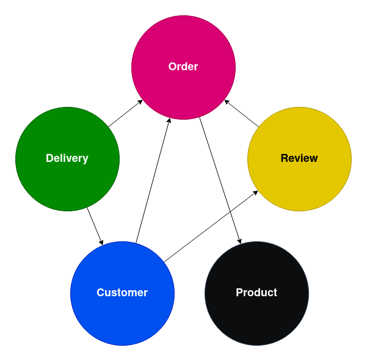

# Waiter

## Introduction
Waiter is a Spring Boot backend application built for proccessing orders to serve the catering industry.
The application is built using a microservice architecture.

## architecture
Waiter will be a distributed system and will contain the following services:

