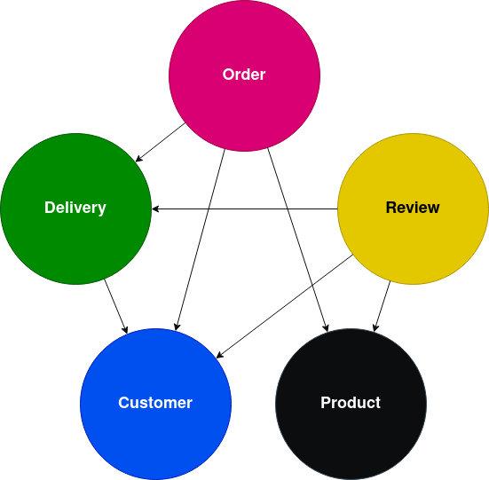
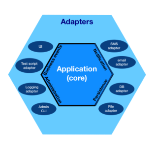

# Waiter

## Introduction
Waiter is a Spring Boot backend application built for proccessing orders to serve the catering industry.
The application is built using a microservice architecture.

## Architecture
Waiter will be a distributed system and will contain the following services:

## Documentation

### Architecture
All of the different services make use of the [Hexagonal architecture](https://en.wikipedia.org/wiki/Hexagonal_architecture_(software)).

Implementation details are done by the outbound 'ports', this means that the application doesn't have care about the internal
workings of the (for example) `Repository`.

### Events and REST calls of the services

#### [Customer micro-service](./customer/README.md)

#### [Delivery micro-service](./delivery/README.md)

#### [Order micro-service](./order/README.md)

#### [Product micro-service](./product/README.md)

#### [Review micro-service](./review/README.md)

